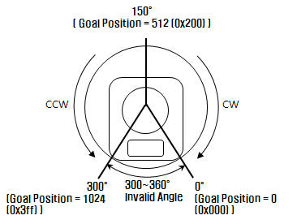
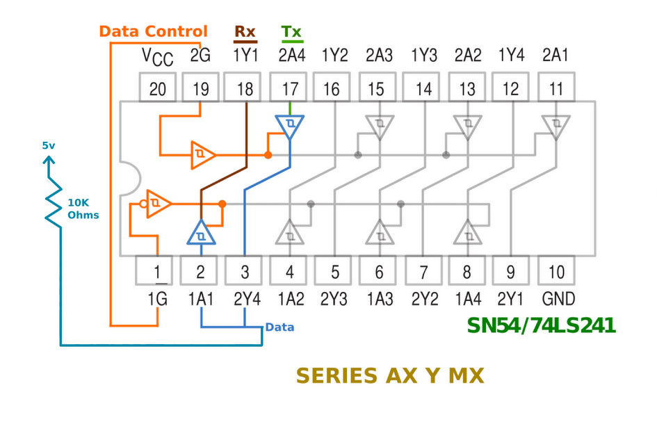

This is the cheaper version of the AX-12 using the newer protocol, but the
Lego snap interface doesn't make tight fitting parts. The older screw/nut
connections, which can be a pain at times, produces a better connection.

- Weight : 16.7g
- Dimension : 24mm x 36mm x 27mm
- Resolution : 0.29°
- Motor : Cored Motor
- Gear Reduction Ratio :  238 : 1
- Stall Torque : 0.39 N.m (at 7.4V, 1.1A)
- No load speed : 114 rpm (at 7.4V, 0.18A)
- Running Degree
	- 0° - 300°
	- Endless Turn
- Running Temperature : -5C - +70C
- Voltage : 6  - 8.4V (Recommended Voltage 7.4V)
- Command Signal : Digital Packet
- Protocol Type : Half duplex Asynchronous Serial Communication (8bit,1stop,No Parity)
- Link (Physical) : TTL Level Multi Drop (daisy chain type Connector)
- ID : 253 ID (0-252)
- Communication Speed : 7343bps - 1 Mbps
- Feedback : Position, Temperature, Load, Input Voltage, etc.
- Material : Engineering Plastic

# Hardware Interface

The xl-320 servos use a half duplex, single master, multi-slave
serial interface between all of the servos. There are multiple designs on the interweb
you can build (or buy) to connect a computer or microcontroller to the servos.

# Current

I use a Sparkfun USB-to-serial port with 5V TTL. This allows me to also use
the Bluetooth modem in the RPi. Then interface with a modified Robotis solution
as shown above. Note: Data is the signal to/from the servo, TX is transmit,
RX is receive, and DTR/RTS is either one of those (not both) signals to control data
direction.

- Keep Bluetooth
- No logic level conversion
- For debugging/dev I can plug the USB serial into my Macbook and develop

# History

I have played around with **many** different ways to interface with the xl-320.
They all have pro's and con's.

| Method | Notes |
|---|---|
| Robotis Suggested | Requires an signal for data direction |
| 74LS241 | Has the NOT built into the chip w/ tri-state buffers, but only comes in a 20 pin DIP ... large foot print |
| Pixl | Simple, use TX as your direction, but you can get an echo on the RX signal. Software will filter  it out. |
| My way | I use the Robotis method, but removed the NOT gate and created one out of extra 74LS126 input. I use DTR (or RTS ... I just toggle both of them) as the data direction. |

## Serial Ports

- Raspberry Pi Serial port:
    - The RPi's serial port is 3.3V while the servos communicate at 5V, so you
	  have to use 3.3V to 5V shifting on the RX/TX lines
	- The RPi 3 serial port isn't a good serial port and will change data rate on
	  you based on the clock speed (which changes if it gets too hot). This can
	  lead to problems.
	      - The good serial port (clock independent) is tied to the Bluetooth
		    modem, you can go through a painful process to disable the Bluetooth
			modem and make it available. However, you loose Bluetooth (which I
			find useful).
- USB serial port:
    - This seems unnecessary since the RPi already has a serial port, but see the
	  issues above
	- I am now using a USB serial port with logic levels at 5V and I am avoiding
	  extra parts for logic level conversion.
	- I get to keep my Bluetooth which I use for other things
	- However,  this adds bulk ... even though the board is small, the USB cable
	  isn't
	- **Don't** be tempted to get a cheap USB device, make sure it is an FTDI so
	  you don't have to worry about driver. I messed with that for a little bit
	  and it was a pain. Linux support is said, until you dig around and find
	  out it is for Kernels 2.x and 3.x and currently linux is at 4.x. $7 down
	  the drain ... thanks Sparkfun, way to understand your products!

## Robotis Suggested

This uses a 74HC126 tri-state buffer to interconnect the data line with a standard UART.
To switch between the Tx and Rx signals, a third signal (direction port) is used. In my
software, I use the `pyserial` RTS signal for the direction signal. **Unfortunately,
not all USB serial interfaces breakout the RTS pin**

## 74LS241 Interface

I have used the [74LS241](http://savageelectronics.blogspot.com/2011/01/arduino-y-dynamixel-ax-12.html)
to talk to the xl-320. This has a higher pin count, but the NOT is included in the chip. It works, but
requires the extra RTS pin of the serial port to toggle direction.

## Modified Pixl

The [Poppy Project](https://www.poppy-project.org) designed an ingenious board call [Pixl](https://github.com/poppy-project/pixl)
that allows a standard UART (without the extra direction pin) to talk to the servos.
This is the hardware design I am currently using.

I was using a 74AHCT126 tri-state buffer with a Vcc of 5V. Now, this is more than an interface, it also produces all of the necessary voltages
(3.3V, 5V, and 7.5V) needed to talk to the servo. I use this one for debugging and
software development of `pyxl320` when I am on my Macbook.

## What Happened to the Raspberry Pi GPIO Version

An earlier version of my library used the RPi's GPIO pin 17 as the direction pin when
I used the 74LS241 chip above. It worked, but once I switched the Pixl interface, it
became redundant. Since I didn't need it any more, I removed it. If you use a standard
USB-to-serial converter or the RPi's UART, **you don't need GPIO if you use the Pixl
circuit** shown above.

# References

- [Mosfet logic level converter tutorial](https://learn.sparkfun.com/tutorials/bi-directional-logic-level-converter-hookup-guide)
- [Adjustable voltage calculator](http://www.reuk.co.uk/wordpress/electric-circuit/lm317-voltage-calculator/)

# Software Interface

The xl-320 servos use a half duplex uart serial interface to send packets
of back and forth between the servo and the controlling computer.

[e-Manual](http://emanual.robotis.com/docs/en/dxl/x/xl320/)

## Packet Basics

|Header                  | ID | Length        | Instruction | Parameter                     | CRC |
|------------------------|----|---------------|-------------|-------------------------------|-----|
| [0xFF, 0xFF, 0xFD, 0x00] | ID | [LEN_L, LEN_H] | INST | [PARAM 1, PARAM 2, ..., PARAM N] | [CRC_L, CRC_H] |

Packet format:

[0xFF, 0xFF, 0xFD, 0x00, ID, LEN_L, LEN_H, INST, PARAM 1, PARAM 2, ..., PARAM N, CRC_L, CRC_H]

- Header: 0xFF, 0xFF, 0xFD
- Reserved byte: 0x00
- Servo ID: ID
- Packet Length: Len_l, len_h
- Instruction: INST
- Parameters: Param 1 ... Param N
- CRC: crc_l, crc_h

A status packet back from the servo follows the same format, but the instruction
is always `0x55` and maybe followed by error codes if something is wrong.
The length of the packet is aways the entire length minus header, id, and crc.
Also remember, the packets are little-endian, so place numbers in the packet
as `[LSB, MSB]`. You can use the function `le()` in `Packet` to accomplish
this. You can also use `word()` to reverse `le()`.

See the references below for more details on the instructions, error codes, etc.

## Packet Constructors

There are basic several packet constructors:

- `makePacket(ID, instr, reg=None, params=None)` - The most generic and the basis for everything
- `makeWritePacket(ID, reg, params=None)` - Makes a packet that writes to a servo register
- `makeReadPacket(ID, reg, params=None)` - Makes a packet that contains an instruction to read from a servo register
- `makePingPacket(ID)` - Makes a packet with the ping instruction in it, forcing servos to repond and let you know what servos are available
- `makeResetPacket(ID, param)` - Makes a packet to reset a servo to its factory default condition ... **becareful**
- `makeRebootPacket(ID)` - Makes a packet that forces a servo to reboot

Now the funciton params are:

- ID - servo ID number
- instr - instruction
- reg - either the RAM or EEPROM register you are writing to or reading from
- params - the packet parameters, some packets have optional parameters

Beyond this, there are more specialized packet constructors for things I use the most.
Some examples are:

- `makeServoIDPacket(curr_id, new_id)` - Sets a servo to a new ID ... **becareful**
- `makeServoPacket(ID, angle)` - Commands a servo to a specified `angle`
- `makeLEDPacket(ID, color)` - Lights up the servo's LED to the specified `color`

I keep adding more, so take a look in the `pyxl320.Packet` folder to see what is already
done for you.

# References:

Unfortunately the Dynamixel references below are **not written well** (many typos
and errors throughout), so please be careful or you will drive yourself crazy trying to fix bugs.
Also they have disappeared on me, so if you get a `404` error, hopefully the docs
will come back.

- [XL-320 e-Manual](http://support.robotis.com/en/techsupport_eng.htm#product/actuator/dynamixel_x/xl_series/xl-320.htm)
- [XL-320 hardware and half duplex circuit](http://support.robotis.com/en/product/actuator/dynamixel_x/xl-series_main.htm)
- [Dynamixel Protocol Ver. 2](http://support.robotis.com/en/product/actuator/dynamixel_pro/communication/instruction_status_packet.htm)
- [PySerial](http://pyserial.readthedocs.io/en/latest/index.html)

---

	
	 This work is licensed under a <a rel="license" href="http://creativecommons.org/licenses/by-sa/4.0/">Creative Commons Attribution-ShareAlike 4.0 International License</a>.

